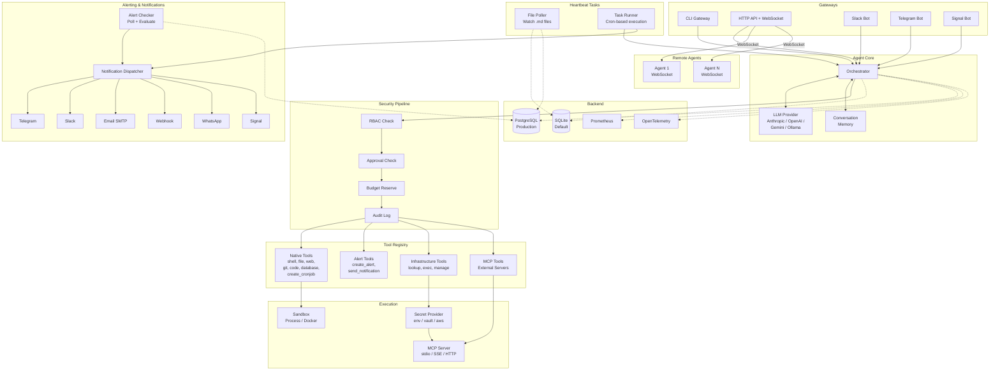

## Architecture

```mermaid
graph TD
    subgraph Gateways
        CLI[CLI Gateway]
        HTTP[HTTP API + WebSocket]
        SLACK[Slack Bot]
        TG[Telegram Bot]
        SIG[Signal Bot]
    end

    subgraph Security["Security Pipeline"]
        RBAC[RBAC Check]
        APPROVAL[Approval Check]
        BUDGET[Budget Reserve]
        AUDIT[Audit Log]
    end

    subgraph Core["Agent Core"]
        ORCH[Orchestrator]
        LLM[LLM Provider<br/>Anthropic / OpenAI /<br/>Gemini / Ollama]
        HISTORY[Conversation<br/>Memory]
    end

    subgraph Tools["Tool Registry"]
        NATIVE[Native Tools<br/>shell, file, web,<br/>git, code, database,<br/>create_cronjob]
        ALERT_TOOLS[Alert Tools<br/>create_alert,<br/>send_notification]
        INFRA[Infrastructure Tools<br/>lookup, exec, manage]
        MCP[MCP Tools<br/>External Servers]
    end

    subgraph Alerting["Alerting & Notifications"]
        CHECKER[Alert Checker<br/>Poll + Evaluate]
        DISPATCH[Notification Dispatcher]
        TGSEND[Telegram]
        SLACKSEND[Slack]
        EMAIL[Email SMTP]
        WEBHOOK[Webhook]
        WASEND[WhatsApp]
        SIGSEND[Signal]
    end

    subgraph HeartbeatTasks["Heartbeat Tasks"]
        HBT_POLLER[File Poller<br/>Watch .md files]
        HBT_RUNNER[Task Runner<br/>Cron-based execution]
    end

    subgraph Execution
        SANDBOX[Sandbox<br/>Process / Docker]
        MCPSERVER[MCP Server<br/>stdio / SSE / HTTP]
        SECRETS[Secret Provider<br/>env / vault / aws]
    end

    subgraph Backend
        SQLITE[(SQLite<br/>Default)]
        PG[(PostgreSQL<br/>Production)]
        PROM[Prometheus]
        OTEL[OpenTelemetry]
    end

    subgraph "Remote Agents"
        WS_AGENT1[Agent 1<br/>WebSocket]
        WS_AGENT2[Agent N<br/>WebSocket]
    end

    CLI & HTTP & SLACK & TG & SIG --> ORCH
    ORCH <--> LLM
    ORCH <--> HISTORY
    ORCH --> RBAC --> APPROVAL --> BUDGET --> AUDIT
    AUDIT --> NATIVE & ALERT_TOOLS & INFRA & MCP
    NATIVE --> SANDBOX
    INFRA --> SECRETS --> MCPSERVER
    MCP --> MCPSERVER
    CHECKER --> DISPATCH
    DISPATCH --> TGSEND & SLACKSEND & EMAIL & WEBHOOK & WASEND & SIGSEND
    HBT_POLLER -.-> SQLITE & PG
    HBT_RUNNER --> ORCH
    HBT_RUNNER --> DISPATCH
    CHECKER -.-> PG
    ORCH -.-> SQLITE & PG
    ORCH -.-> PROM & OTEL
    HTTP -- "WebSocket" --> WS_AGENT1 & WS_AGENT2
```